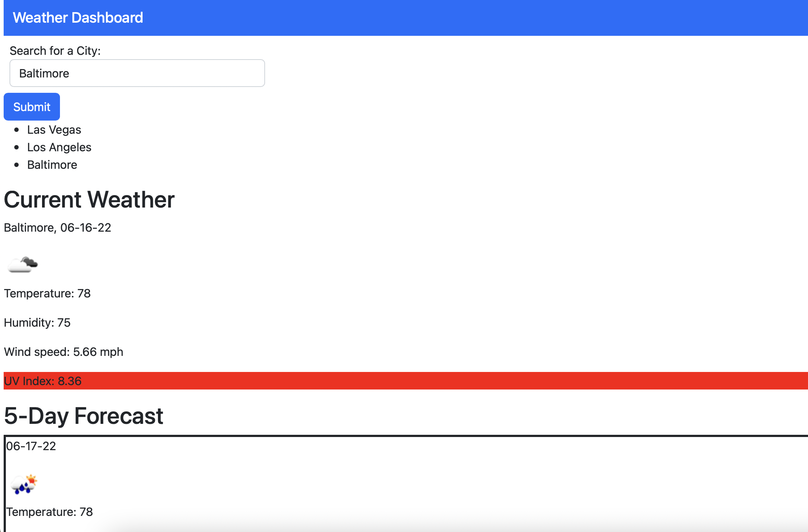

# weather-dashboard

## Description
This weather dashboard provides you with the current weather and upcoming 5 day forecast for a city from user input. The website also stores your past history so you can click on it and easily revisit the weather page for that city. 

## Technologies Used
- Bootstrap
- HTML
- CSS
- Javascript
- Open Weather Map APIs

## Links
- Github Repo: https://github.com/mayalorimer/weather-dashboard 
- Github Pages: https://mayalorimer.github.io/weather-dashboard/ 

## Screenshot 

